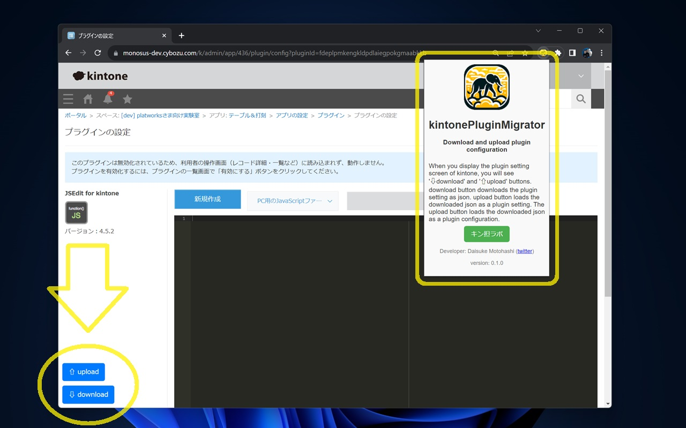

 

# ぷらまい kintonePluginMigrator

「ぷらまい」はkintoneのプラグイン設定をマイグレーションするChrome拡張です。

この拡張機能をインストールしたブラウザから、kintoneのプラグイン設定画面を表示すると左下に'⇩ダウンロード'と'⇧アップロード'の青い2つのボタンが現れます。

## インストール方法

Chromeウェブストアに公開しています。お使いのブラウザ(Chrome または Edge)でストアにアクセスしてインストールしてください。

[ kintonePluginMigrator](https://chromewebstore.google.com/detail/pndmdhhanlckeimjahjfijelpkbgoeac)

## ⇩ダウンロード
ダウンロード機能はjsonとしてプラグイン設定を保存します。保存したjsonファイルは、⇧アップロード機能から読み込むことができます。

## ⇧アップロード
アップロードボタンはプラグイン設定が保存されたjsonをプラグインの設定として読み込みます。jsonファイルはダウンロード機能で保存したものをご利用ください。

## 注意点

全然関係ないjsonファイルを読み込ませるとプラグインの設定が消えることがあります。その場合はアプリの設定を保存せずに、アプリの設定画面から速やかに「変更を中止」ボタンでキャンセルしてください。

# License

ぷらまい kintonePluginMigrator はMITライセンスの元で公開しています。 This plugin is licensed under MIT license.

Copyright (c) 2024 Daisuke Motohashi https://opensource.org/licenses/MIT
